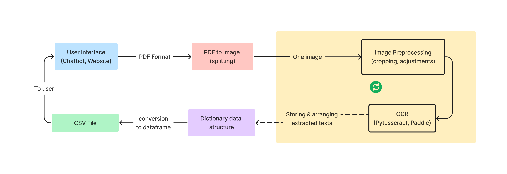
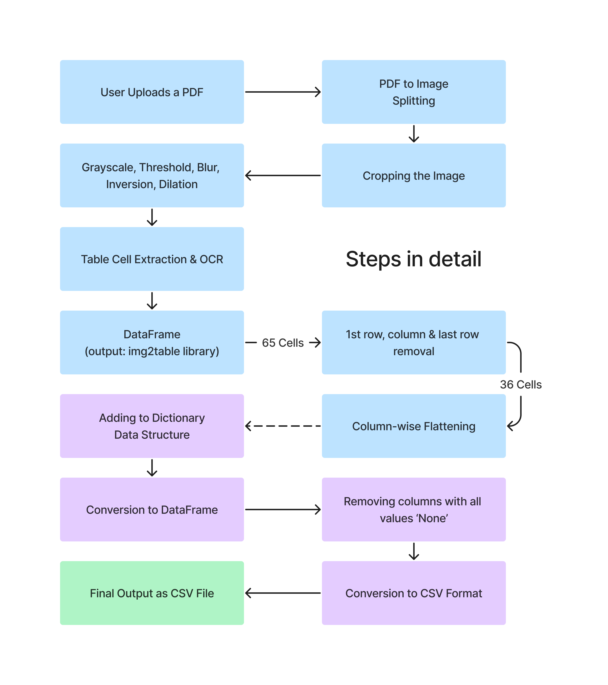
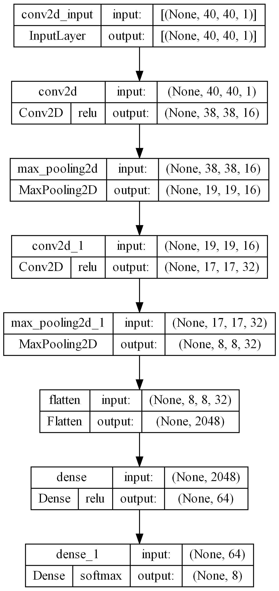

<b><h1 align="center"> MARKS 2 EXCEL </h1></b>

<!-- ---------------------------------------------------  -->

 

Click the drop down to see contents

 Contents 

<!-- [Working of the App](#Working-of-the-App) -->

<!-- [Why not a `WhatsApp Bot`?](#why-not-a-whatsapp-bot) -->

<!-- [More Detailed Working](#More-Detailed-Working) -->

[Programs](#Programs)

[Datasets](#Datasets)

[Problem And Solution](#Problem--Solution)

[Brief Working](#Brief-Working)

[Full Working](#Full-Working)

[Model Architecture](#CNN-Model-Architecture)

[Creators](#Creators)

---

 

## Programs

* Big Model - Program that is able to convert a complete PDF file to CSV

* Base Model - Program that runs on a single paper - used for Prototyping & Testing the approach

* [Big Model - Input PDF, Output CSV](https://github.com/004Ajay/S6_Mini_Project/blob/main/Codes/Image%202%20Table/big%20model%20-%2036%20CELL%20PROBLEM%20SOLVED.ipynb)

* [Neural Network - Training & Testing](https://github.com/004Ajay/S6_Mini_Project/blob/main/Codes/Neural%20Network/Train_Model_Final.ipynb)

* [Base Model - using our CustomOCR](https://github.com/004Ajay/S6_Mini_Project/blob/main/Codes/Image%202%20Table/base%20model%20-%20single%20paper%20from%20start%20to%20end%20--%20LATEST.ipynb)

* [Cell Extraction Program](https://github.com/004Ajay/S6_Mini_Project/blob/main/Codes/Cell%20Extraction/cell_extraction.ipynb)

* [Image Resizer](https://github.com/004Ajay/S6_Mini_Project/blob/main/Codes/Cell%20Extraction/resize_image.ipynb)

---

 

## Datasets

* Files in ZIP format

    * [Training Set](https://github.com/004Ajay/S6_Mini_Project/blob/main/Datasets/training_set.rar)

    * [Testing Set](https://github.com/004Ajay/S6_Mini_Project/blob/main/Datasets/testing_set.zip)

    * [Kaggle Dataset](https://github.com/004Ajay/S6_Mini_Project/blob/main/Datasets/Kaggle_Dataset.zip)
    
    * [College Answer Sheet Dataset](https://github.com/004Ajay/S6_Mini_Project/blob/main/Datasets/College_Answer_Sheet_Dataset.zip)

    * [Half Marks - College Answer Sheet](https://github.com/004Ajay/S6_Mini_Project/blob/main/Datasets/Ans_Sheet_Half_Marks.zip)

    * [Mixed Dataset (College & Kaggle)](https://github.com/004Ajay/S6_Mini_Project/blob/main/Datasets/Mixed_Marks_Dataset.zip)

---

 

## Problem & Solution

* The Problem - Our teachers of SJCET Palai are wasting a good amount of their time entering marks scored by students on individual questions in an exam to excel sheets.

* The Solution - We need to automate the task of entering the marks, for that we use a combination of detection, extraction & recognition algorithms

---

 

## Brief Working

---

 

## Full Working

---

 

## CNN Model Architecture

---

 

## Creators

[Ajay T Shaju](https://github.com/004Ajay)

[Emil Saj Abraham](https://github.com/Emilsabrhm)

[Justin Thomas Jo](https://github.com/Juz-Tom-J)

[Vishnuprasad KG](https://github.com/VISHNUPRASAD-K-G)

<!-- 
---

## Working of the App

* User starts the telegram bot (`bot_name`) → click or type `/start`
* User sends the `PDF file` having front pages of Student's Marksheet
* User waits to receive the `CSV file` containing students marks entered in respective columns
* Names should be entered manually

---

 

## FAQ

### Why not a `WhatsApp Bot`?

WhatsApp also has good features of BOTS. But if we need to build a bot we need:

* A separate mobile number to start WhatsApp Business account
* WhatsApp Business API is paid
* Lack of functionalities & developer support
* Centralized, owned by Meta Platforms (Facebook)

 

---

-->
